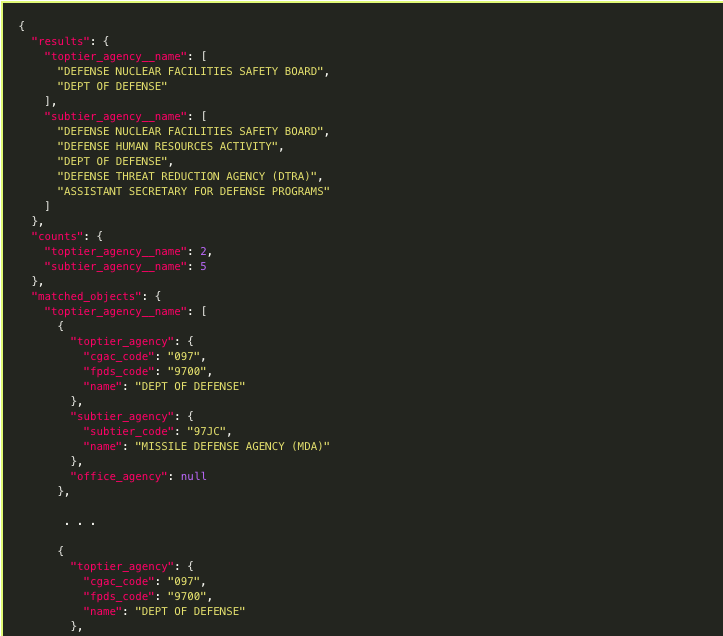
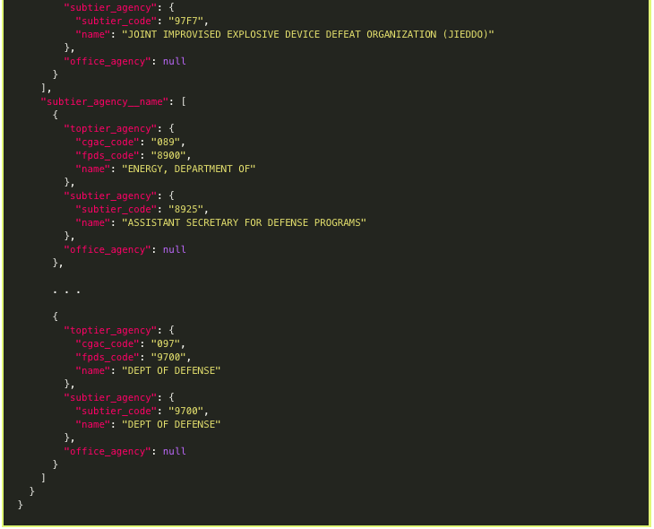
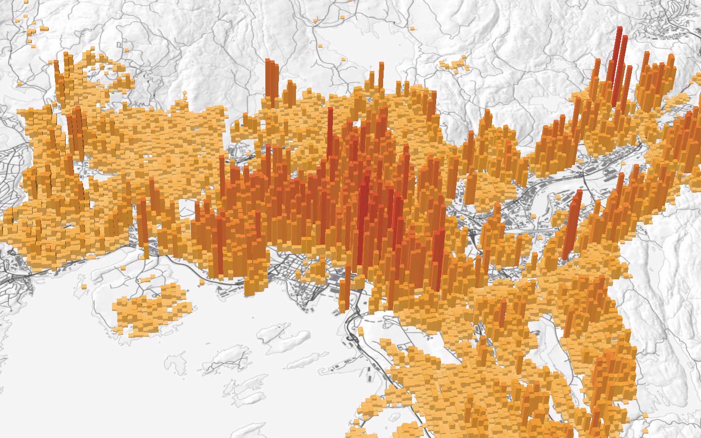

TEAM PPTG

We will look at US Spending by department and:

- Create a dynamic map which adjusts based on a users selection of US government department 

- Show the speding amount by state and potentially other districts

- We are using the API on [usaspending.gov](https://api.usaspending.gov/docs/using-the-api) as our source

- We will use Flask to render our html and handle the database management in conjunction with sqlalchemy/mongoDB

- These are some visualizations we are drawing inspration from

